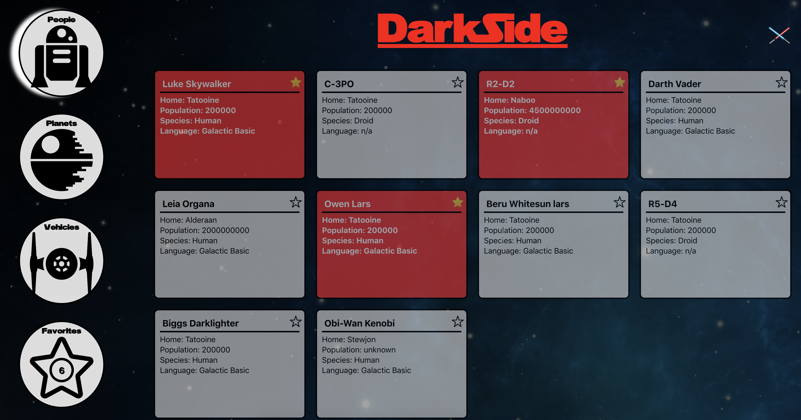

# Darkside / SwapiBox 

Darkside is one week project for Front End Engineering students at the Turing School of Software & Design. Students were tasked with consuming the Star Wars API (SWAPI) to display information about characters, vehicles, planets, and the films. 

This website was build using the create-react-app starter kit. Dependencies include Jest/Enzyme for teting, and propTypes to check component types. We also utilized JavaScript ES6+ when creating all components. 

## Authors:
* Djavan Munroe ([Djavanm](https://github.com/djavanm))
* Jacob Ogren ([eoneill23](https://github.com/jogren))

### Project Images

## Built With
- JavaScript (ES6+)
- Webpack
- Jest
- Enzyme
- HTML5
- CSS3
