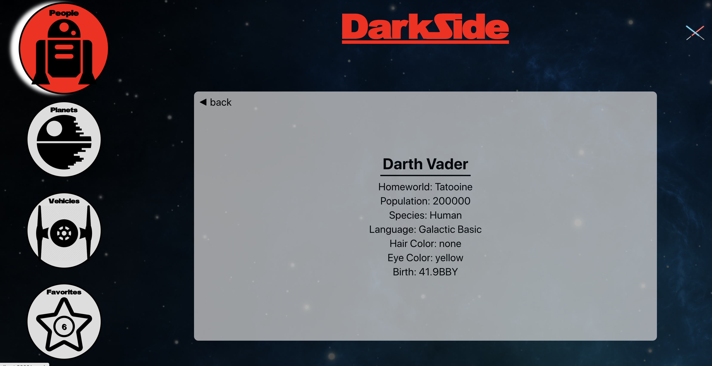

# Darkside / SwapiBox 

Darkside is one week project for Front End Engineering students at the Turing School of Software & Design. Students were tasked with consuming the Star Wars API (SWAPI) to display information about characters, vehicles, planets, and the films. The user is able to favorite any card on the screen, and their current list of favorites will persist after page relod, using the local storage API. 

This website was built using the create-react-app starter kit. Dependencies include Jest/Enzyme for teting, and propTypes to check component types. We also utilized JavaScript ES6+ when creating all components. 

## Authors:
* Djavan Munroe ([Djavanm](https://github.com/djavanm))
* Jacob Ogren ([eoneill23](https://github.com/jogren))

### Project Images

## Built With
- React
- JavaScript (ES6+)
- Webpack
- Jest
- Enzyme
- HTML5
- CSS3
